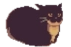
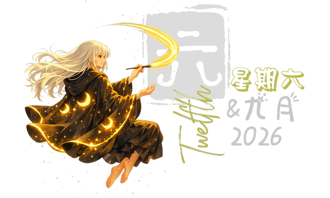

# Hi! I'm Harry 

- 🌱 I'm currently learning **MCP, LangChain and event queueing**

- 💬 Ask me about **Self-hosting** ＼(ﾟｰﾟ＼)

> On the right is a **live Chinese Calendar** (it's updated via CI/CD >:) )

<h3 align="left">Connect with me:</h3>

<h3 align="left">Languages and Tools:</h3>

<h3 align="left">Badges:</h3>

<!--
**FPTSTUDEN/FPTSTUDEN** is a ✨ _special_ ✨ repository because its `README.md` (this file) appears on your GitHub profile.

Here are some ideas to get you started:

- 🔭 I’m currently working on ...
- 🌱 I’m currently learning ...
- 👯 I’m looking to collaborate on ...
- 🤔 I’m looking for help with ...
- 💬 Ask me about ...
- 📫 How to reach me: ...
- 😄 Pronouns: ...
- ⚡ Fun fact: ...
-->

