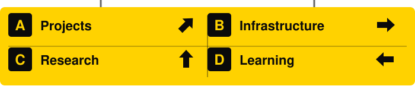
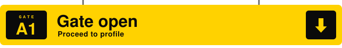

# ✈️ HARRY INTERNATIONAL AIRPORT

<!-- ## 01 — Arrival Detected -->

<!-- AIRPORT ASSET: arrivals-terminal.svg -->

<!--  -->

<!-- OFFICER AVATAR: /assets/officer/welcome.svg -->

<table>
<tr>
<td valign="top" align="center">

**OFFICER ON DUTY**

</td>
<td valign="top">

<!-- ### "Welcome, traveler." -->

<!-- DYNAMIC SVG SPEECH BUBBLE -->
<!-- Replace this placeholder with /banner/speech-bubble.svg -->

<!--  -->

<!-- Your arrival has been registered. The local time at your point of origin is **{{local_time}}**. -->
Welcome to Harry International. 

May I ask the purpose of your visit?

*Professional curiosity? Excellent.*

Please take your arrival card.

<!-- ARRIVAL CARD ASSET: /assets/arrival-card.svg -->

<!--  -->

Following routine administrative review, entry to this profile is hereby authorized.

</td>
</tr>
</table>

---

<!-- ## Destination Briefing -->

<!-- AIRPORT ASSET: directory-board.svg -->

<table>
<tr>
<td valign="top" align="center">

**INFORMATION DESK**

</td>
<td valign="top">

### Allow me to introduce your destination.

This profile contains a selection of technical projects, infrastructure experiments, and ongoing investigations into the inner workings of computers.

| Terminal | Exhibits |
|---|---|
| **A — Projects** | Software, applications, and things I've built |
| **B — Infrastructure** | Cloud, DevOps, containers, and self-hosting |
| **C — Research** | AI, automation, and technical rabbit holes |
| **D — Learning** | Skills acquired, lessons learned, and unfinished business |

<!-- AIRPORT ASSET: /assets/directory-board.svg -->

*Please note that some exhibits remain under construction. This is not grounds for a refund.*

</td>
</tr>
</table>

---

<!-- AIRPORT ASSET: departure-gate.svg -->

<table>
<tr>
<td valign="top" align="center">

**OFFICER ON DUTY**

</td>
<td valign="top">

<!-- AIRPORT ASSET: /assets/gate-open.svg -->

### You are free to proceed.

Thank you for choosing Harry International.

We wish you a productive visit and a pleasant browsing experience.

*We kindly remind you that curiosity is not subject to customs duty, and there is no penalty for staying longer than anticipated.*

</td>
</tr>
</table>

---

HARRY INTERNATIONAL · DEPARTMENT OF UNNECESSARY FORMALITIES · EST. SOME TIME AGO

⬇️ **PLEASE PROCEED TO THE REST OF THE PROFILE** ⬇️

