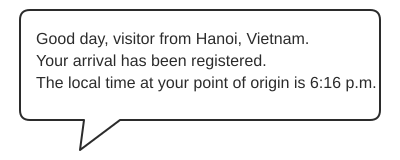
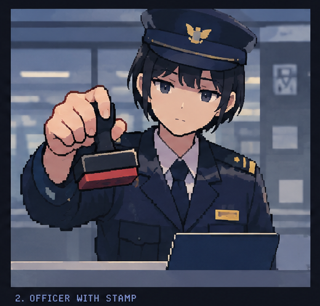

# ✈️ Welcome to My Terminal

> **HARRY INTERNATIONAL — IMMIGRATION SERVICES**
>
> *Your curiosity is welcome. Your visit is now on record.*

---

<!-- ## 01 — Arrival Detected -->

<!-- AIRPORT ASSET: arrivals-terminal.svg -->

<!--  -->

<!-- OFFICER AVATAR: /assets/officer/welcome.svg -->

<table>
<tr>
<td width="150" valign="top" align="center">

**OFFICER ON DUTY**

</td>
<td valign="top">

### "Welcome, traveler."

<!-- DYNAMIC SVG SPEECH BUBBLE -->
<!-- Replace this placeholder with /banner/speech-bubble.svg -->

<!--  -->

<!-- Your arrival has been registered. The local time at your point of origin is **{{local_time}}**. -->

May I ask the purpose of your visit?

*Professional curiosity? Excellent. Please proceed to document verification.*

</td>
</tr>
</table>

---

## 02 — Entry Approved

<!-- AIRPORT ASSET: immigration-counter.svg -->

<table>
<tr>
<td width="150" valign="top" align="center">

**IMMIGRATION OFFICER**

</td>
<td valign="top">

### "Your documents are in order."

Your declared purpose of visit has been classified as **professional curiosity**.

Following routine administrative review, entry to this profile is hereby authorized.

<!-- ARRIVAL CARD ASSET: /assets/arrival-card.svg -->

<!--  -->

<!-- APPROVAL STAMP ASSET: /assets/stamp-approved.svg -->

Please retain your arrival card for the duration of your visit. It has no legal significance whatsoever, but considerable administrative importance.

</td>
</tr>
</table>

---

## 03 — Destination Briefing

<!-- AIRPORT ASSET: directory-board.svg -->

<table>
<tr>
<td width="150" valign="top" align="center">

**INFORMATION DESK**

</td>
<td valign="top">

### "Allow me to introduce your destination."

This profile contains a selection of technical projects, infrastructure experiments, and ongoing investigations into the inner workings of computers.

| Terminal | Exhibits |
|---|---|
| **A — Projects** | Software, applications, and things I've built |
| **B — Infrastructure** | Cloud, DevOps, containers, and self-hosting |
| **C — Research** | AI, automation, and technical rabbit holes |
| **D — Learning** | Skills acquired, lessons learned, and unfinished business |

<!-- AIRPORT ASSET: /assets/directory-board.svg -->

Please note that some exhibits remain under construction. This is not grounds for a refund.

</td>
</tr>
</table>

---

## 04 — Final Clearance

<!-- AIRPORT ASSET: departure-gate.svg -->

<table>
<tr>
<td width="150" valign="top" align="center">

**HAVE A NICE JOURNEY**

</td>
<td valign="top">

### "You are free to proceed."

Your entry has been approved. You may now explore the profile at your own discretion.

We kindly remind you that curiosity is not subject to customs duty, and there is no penalty for staying longer than anticipated.

<!-- AIRPORT ASSET: /assets/gate-open.svg -->

Thank you for choosing Harry International.

We wish you a productive visit and a pleasant browsing experience.

**This concludes all mandatory formalities.**

HARRY INTERNATIONAL · DEPARTMENT OF UNNECESSARY FORMALITIES · EST. SOME TIME AGO

</td>
</tr>
</table>

---

*Your journey ends here. The rabbit hole begins below.*

⬇️ **PLEASE PROCEED TO THE REST OF THE README** ⬇️

## Extra UI details that sell the joke

These are the little touches that make the banner feel like a real immigration system rather than five unrelated illustrations.

['Papers, Please' gets a Game & Watch demake for its 10th anniversary](https://images.openai.com/static-rsc-4/i7vzbbVKBuqWt0WbjD_vXECwqUl1WxOzskZEPM8-aHESdTkzSpf-_aA1S8RrInDTG1Q4or2alI3fKHO-5qKE1DEwSHaniGWNWv4bcPdXr9lHzHWKbPWmgU9Lkwp9gj7XyrsGz1bSTHW8mnIW7CmtWp6I4c1-2I0OJiBS5def4Gc?purpose=inline)

The arrival card

Origin, local time, declared purpose, destination. Make the fields look official but mildly ridiculous.

[Glory to Arstotzka! Papers, Please has sold 5 million copies in a decade](https://images.openai.com/static-rsc-4/aAPbrDV5jIPqXZH0aoaqEFhIMgH9kyyw5ddMyJ_rhL7b_kqWX3vjTG8PwZuOQEl_Zit8M-6W225qAaAryAJPCyhDIl3N9hQF-prq7O-wGJ67EtWxn-x_ClXYNa2xESyM289Gxh4CihD35UpKt3QNyUmS6YBDaDKZI6W9cude_Hs?purpose=inline)

The approval stamp

A bold visual reward when the dialogue reaches “Entry granted.” Reuse this graphic throughout the interface.

[Airport Information Signs](https://images.openai.com/static-rsc-4/bQ5QAidhsAnQf6awwYk6OHyxwvh_zcNPXlYzliuE-M57RVeIUV9xuCfExnZ0LI2aP9mtT9Q7qvgIoqW1kMVEWMGbNRq-xX9FQ6c7dTsLuD-0kVEBUDSJDZUrLnzj_qfkYfuQZkOeYSwyPQzn45bParND5mVygZ8zLSg9CBOjknyEf9uLGsbu8_wI3dmClHlf?purpose=inline)

The profile directory

Use icons and arrows to preview actual README sections instead of showing a wall of text.

[Ahorra un 30 % en «Nothing To Declare» en Steam](https://images.openai.com/static-rsc-4/9zZRkwu7qSptnLbewl4TfFUrIT8EkKu8rn1J3TGWjkug3SOUf3pXAqLLF2fqEE8dRwl634-p1erEarw9sDQKxTy6mbrbWBgV-9bjLa2P1JmlD7xEs5yE7c29EbZoptLQV0icOiTsj_gh7duQCuAlOcJJhL5RS5z41rtBZ68egCk?purpose=inline)

The clearance status

Progress from `PROCESSING` to `APPROVED` to `WELCOME`. Keep the same layout and change only the state.

## How I'd implement this in the SVG

Keep one consistent composition rather than swapping the entire banner each time.

IMMIGRATION CONTROL

FORM RC-001

[Umi Sonoda Love Live! School Idol Festival Anime Policeman Honoka Kōsaka, Anime, love, black Hair, love Live School Idol Festival png | PNGWing](https://images.openai.com/static-rsc-4/ieHd7oDgqdotICGW4ssHrlh4sN4Fp64o7_jrWt6jPc6AgKF7JvfXBPSUXLX81eFQZkmp-wRrVdQu2uRegCJFiaZFZwO9-crDH7LtsAmod19CuY1czixqdtgvLJ8IkfAWxrNrPhMaqvs0CRykVE_DvY0NdHad6eRGr7fg0F7FuTA?purpose=inline)

OFFICER ON DUTY

## Welcome, traveler.

Origin: ,&#x20;

Local time:&#x20;

ARRIVAL CARD ACCEPTED

“Your purpose of visit has been classified as professional curiosity. Please proceed to the profile directory.”

GITHUB IMMIGRATION SERVICES

Concept mockup: a fixed officer portrait, dynamic arrival details, a changing status panel, and one dialogue area.

My recommendation: animate the props and status, not every pixel of the character. Five expressions or poses, one arrival-card graphic, and one reusable stamp can make the entire experience feel cohesive. Keep the city and time as dynamic text generated by the Worker, while the officer art stays static and cache-friendly.